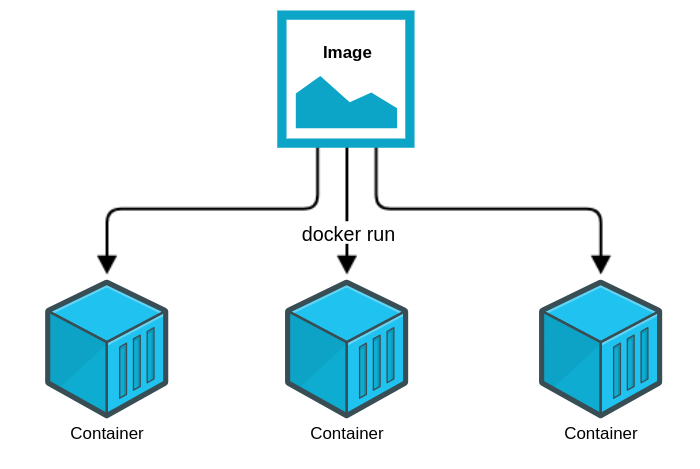
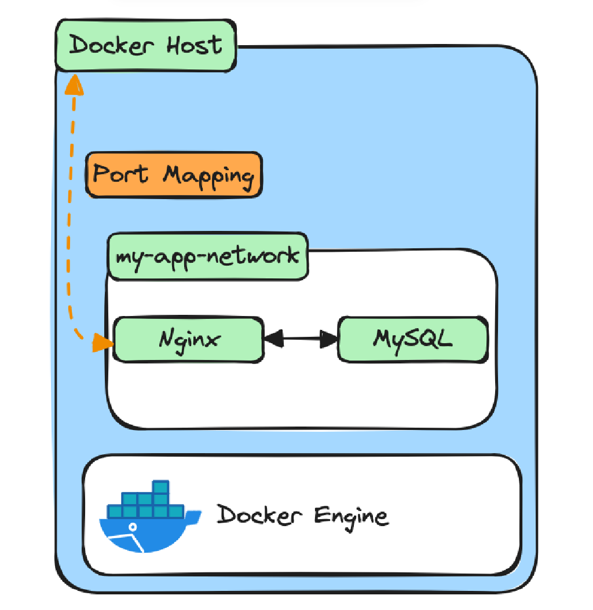

# Docker


## Command Summary

 - `docker run [image]`: runs a container from the image.

 - `docker ps`: list running containers.

 - `docker ps -a`: lists all containers including stopped ones.

 - `docker image ls`: list local images.

 - `docker pull [image:tag]` : download the image from [docker hub](https://hub.docker.com/).

  -  `docker image rm bce` : remove image with ID starting with bce.

  - `docker stop bce` : stop container with ID starting with `bce`.

  - `docker start bce` : start container with ID starting with `bce`.  

  - `docker rm bce` : remove stopped container with ID starting with `bce`.
  
  - `docker container prune`: delete all stopped containers.

  - `docker run --name [contname]  [image]` : run a container named `[contname]` from the image `[image]`.
  - docker run options:
    
    - `-d` : detached.
    - `-it`: interactive terminal.
    - `-p hostp:contp`: map host port to container port.
    - `--name` : specify a name for the container.
    - `--rm`: automatically delete the container when stopped.
    - `-e ABC=123` : pass an environmental variable named ABC with value 123.
- `docker log [container_name]` : view the logs printed previously to terminal.
- `docker exec -it ubuntu01 /bin/bash`: opens a shell to a running container named ubuntu01.


## Install Docker

1) Option 1 install [Docker Desktop](https://docs.docker.com/desktop/).
2) Option 2 install [Docker Engine](https://docs.docker.com/engine/install/).

## Images vs Containers





Images are templates that can be reused to create as many containers as we need. They specify things like:

  - Filesystem
  - users
  - default command to perform when a container runs.
  - Environmental Variables
  - and much more

  we share images (upload and download) 

  
Images = Recipes

Containers = actual dish 

## Hello World

First container to test the system:

```bash
docker run hello-world
```


## Start/Stop/Remove a container

`docker stop bce` : stop container with ID starting with `bce`.

`docker start bce` : start container with ID starting with `bce`.

`docker rm bce` : remove stopped container with ID starting with `bce`.


## Tags

To pick a specific version of an image use the tag:

```bash

docker run nginx:1.27.3-bookworm-perl
```

## Environmental Variables

Example:

```bash
docker run -e ABC=123 -e DEF=456 python:3.12 python -c "import os; print(os.environ)"
```

## Slim and Alpine Images on docker hub

Tags including the `slim` keyword are smaller than regular images:

python:3.12 is about 1.5 GB where as python:3.12-slim is less that 10th of that.

```bash
ibrahim@ibrahim-20ve:~/Documents/GitHub/UnixTools/docker_tutorial/DemoScript$ docker image ls
REPOSITORY   TAG         IMAGE ID       CREATED       SIZE
python       3.12-slim   10f3aaab98db   3 weeks ago   185MB
python       3.12        251ef8e69b6c   3 weeks ago   1.47GB
nginx        latest      42e917aaa1b5   4 weeks ago   278MB
ibrahim@ibrahim-20ve:~/Documents/GitHub/UnixTools/docker_tutorial/DemoScript$ 
```

Alpine images are even smaller:

```bash
ibrahim@ibrahim-20ve:~/Documents/GitHub/UnixTools/docker_tutorial/DemoScript$ docker image ls
REPOSITORY   TAG           IMAGE ID       CREATED       SIZE
python       3.12-alpine   fd340d298d9d   3 weeks ago   73.2MB
python       3.12-slim     10f3aaab98db   3 weeks ago   185MB
python       3.12          251ef8e69b6c   3 weeks ago   1.47GB
nginx        latest        42e917aaa1b5   4 weeks ago   278MB
```

slim is debian based which we know, whereas alpine is a linux system that we need to learn.

## Debugging 

The easiest way is to open a shell to the container:

```bash
ibrahim@ibrahim-20ve:~/Documents/GitHub/UnixTools/docker_tutorial/DemoScript$ docker ps
CONTAINER ID   IMAGE     COMMAND                  CREATED          STATUS          PORTS                  NAMES
774f8451d59e   nginx     "/docker-entrypoint.…"   52 minutes ago   Up 52 minutes   0.0.0.0:8080->80/tcp   nifty_visvesvaraya
ibrahim@ibrahim-20ve:~/Documents/GitHub/UnixTools/docker_tutorial/DemoScript$ docker exec -it nifty_visvesvaraya /bin/bash
root@774f8451d59e:/# whoami
root
root@774f8451d59e:/# CTRL+d to exit
```

## Persistence

Every time you create a container from an image it's a fresh one which means once a container is stopped all data is lost.

try this:

```bash
docker run python:3.12  python -c 'f="/data.txt";open(f,"a").write(f"Ran!\n");print(open(f).read())'
```

this will give us one `RAN!` word only:

```bash
ibrahim@ibrahim-20ve:~/Documents/GitHub/UnixTools/docker_tutorial/DemoScript$ docker run python:3.12 python  -c 'f="/data.txt";open(f,"a").write(f"Ran!\n");print(open(f).read())'
Ran!

ibrahim@ibrahim-20ve:~/Documents/GitHub/UnixTools/docker_tutorial/DemoScript$ docker run python:3.12 python  -c 'f="/data.txt";open(f,"a").write(f"Ran!\n");print(open(f).read())'
Ran!
```

we can fix that with a mount or volume:
```bash
docker run -v mydata:/data python:3.12  python -c 'f="/data/data.txt";open(f,"a").write(f"Ran!\n");print(open(f).read())'
```

the data is persistent:

```bash
ibrahim@ibrahim-20ve:~/Documents/GitHub/UnixTools/docker_tutorial/DemoScript$ docker run -v mydata:/data python:3.12  python -c 'f="/data/data.txt";open(f,"a").write(f"Ran!\n");print(open(f).read())'
Ran!

ibrahim@ibrahim-20ve:~/Documents/GitHub/UnixTools/docker_tutorial/DemoScript$ docker run -v mydata:/data python:3.12  python -c 'f="/data/data.txt";open(f,"a").write(f"Ran!\n");print(open(f).read())'
Ran!
Ran!

ibrahim@ibrahim-20ve:~/Documents/GitHub/UnixTools/docker_tutorial/DemoScript$ docker run -v mydata:/data python:3.12  python -c 'f="/data/data.txt";open(f,"a").write(f"Ran!\n");print(open(f).read())'
Ran!
Ran!
Ran!
```

### Volumes vs Bind-Mounts

Volumes:
- newer.
- More features.
- Managed by docker daemon.
- Syntax:
    - -v mydata:/path/in/container
    - or more verbose --mount

Bind-Mounts:
- Older (but still usefull).
- Less Features.
- Mounts host file/dir into container.
- Syntax:
    - -v ./mydata:/path/in/container
    - -v /mydata:/path/in/container.
    - or more verbose --mount.
Example Bind Mount:

```bash
mkdir mydata
docker run -v ./mydata:/data python:3.12  python -c 'f="/data/data.txt";open(f,"a").write(f"Ran!\n");print(open(f).read())'
```

```bash
ibrahim@ibrahim-20ve:~/Documents/GitHub/UnixTools/docker_tutorial/DemoScript$ docker volume ls
DRIVER    VOLUME NAME
ibrahim@ibrahim-20ve:~/Documents/GitHub/UnixTools/docker_tutorial/DemoScript$ mkdir mydata
ibrahim@ibrahim-20ve:~/Documents/GitHub/UnixTools/docker_tutorial/DemoScript$ docker run -v ./mydata:/data python:3.12  python -c 'f="/data/data.txt";open(f,"a").write(f"Ran!\n");print(open(f).read())'
Ran!

ibrahim@ibrahim-20ve:~/Documents/GitHub/UnixTools/docker_tutorial/DemoScript$ docker run -v ./mydata:/data python:3.12  python -c 'f="/data/data.txt";open(f,"a").write(f"Ran!\n");print(open(f).read())'
Ran!
Ran!

ibrahim@ibrahim-20ve:~/Documents/GitHub/UnixTools/docker_tutorial/DemoScript$ cd mydata/
ibrahim@ibrahim-20ve:~/Documents/GitHub/UnixTools/docker_tutorial/DemoScript/mydata$ ls
data.txt
ibrahim@ibrahim-20ve:~/Documents/GitHub/UnixTools/docker_tutorial/DemoScript/mydata$ cat data.txt 
Ran!
Ran!
```

**Bind-Mounts better for Development**
**Volumes better for Production**

For more info see the docker docs for [volumes](https://docs.docker.com/engine/storage/volumes/) and [Bind-Mounts](https://docs.docker.com/engine/storage/bind-mounts/).


## Port Mapping




for web development we need to communicate with our apps through ports.

let's run a web server:

```bash
docker run nginx
```

now open http://localhost
this won't open since the container doesn't have a mapped port to our localhost.

To map the port:

```bash
docker run -d -p 8080:80 nginx
```

`-d` : detached to free the terminal

`-p 8080:80` : port mapping Host-port:Container-port.

now navigate to http://localhost:8080/.